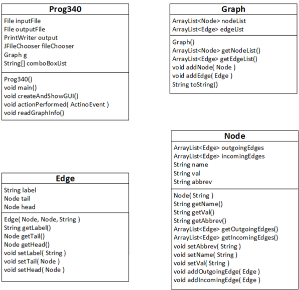

# Ledarh's A* Search Shortest Path algorithm
<h4> <span> · </span> <a href="https://github.com/ledarh/A* Search Shortest Path Java/blob/master/README.md"> Documentation </a> <span> · </span> <a href="https://github.com/ledarh/A* Search Shortest Path Java/issues"> Report Bug </a> <span> · </span> <a href="https://github.com/ledarh/A* Search Shortest Path Java/issues"> Request Feature </a> </h4>


# :notebook_with_decorative_cover: Documentation
This program reads a textfile composed interpreted as graph data and then uses the A* Shortest Path Algorithm to determine the shortest path from the node with `val` attribute `S` to node `G`.

```
~       val   A   B   C   D   E 
Alpha     ~   ~   3   2   ~   5
Bravo     S   4   ~   5   3   ~
Charlie   G   9   ~   ~   ~   ~
Delta     ~   6   ~   5   ~   1
Echo      ~   ~   6   4   2   ~
```

* The first row is a header row.
  - The first “~” is merely a placeholder.  All files will have this at the beginning of the header row.
  - `val` is a column label for the column of node values.
  - In the included test files, the rest of the strings are mnemonics for the nodes of the graph.
    - The strings must be alphanumeric and can not contain spaces.
* Each subsequent row describes one node and its outgoing edges.
  - The first column contains the name of the node (e.g., “Alfa”)
  - The string in the `val` column is the _value_ of the node.
  - For the rest of the columns, if there is no edge going from the node to another node, there is a “~“ in the appropriate column.  Otherwise, there will be a label for the edge from the row node to the column node.
    - This label will be an integer, often a positive integer denoting the distance from the row node to the column node.

## Program Classes and Methods
* There are 4 classes in the program given to you (in addition to a stub class for each deliverable, A-D):
* _Prog340_ is the main class, which handles the I/O.
* _Graph_ is a class whose objects represent graphs.
* _Node_ is a class whose objects represent nodes (a.k.a., vertices) in the graph.
* _Edge_ is a class whose objects represent edges (a.k.a., arcs) between nodes of the graph.  Note that each edge has a direction.  It goes from one specific node to another specific node.


> [!NOTE]
> See Deliv_D_spec.docx, Architexture.docx for further documentation of boilerplate architexture and specific class behaviors/intended uses.
# UML Diagram
The the following are the UML diagrams of the classes utilized:

<picture>
  <source srcset="boilerplate_classes_UML.png">
  
</picture>
<picture>
  <source media="(prefers-color-scheme: dark)" srcset="boilerplate_classes_UML-dark.png">
  <source media="(prefers-color-scheme: light)" srcset="boilerplate_classes_UML.png">
  
</picture>


## :star2: About the Project 
This java 18 SE implementation of A* Shortest Path in Java was originally written for a 300-level undergraduate computer science course. This program was developed by myself in conjunction with the relevent course and accompanying documentation materials have been adapted from the originals originally created by Mike Stein.


<!--- # :notebook_with_decorative_cover: Table of Contents

- [About the Project](#star2-about-the-project)
- [Contact](#handshake-contact) 
--->


## :handshake: Contact

Kelly Higgins - [@HiggKelly](https://twitter.com/HiggKelly) - higginskm@proton.me


<!---
> [!NOTE]
> Useful information that users should know, even when skimming content.

> [!TIP]
> Helpful advice for doing things better or more easily.

> [!IMPORTANT]
> Key information users need to know to achieve their goal.

> [!WARNING]
> Urgent info that needs immediate user attention to avoid problems.

> [!CAUTION]
> Advises about risks or negative outcomes of certain actions.


You can add emoji to your writing by typing :EMOJICODE:, a colon followed by the name of the emoji.

@octocat :+1: This PR looks great - it's ready to merge! :shipit:


<picture>
  <source media="(prefers-color-scheme: dark)" srcset="https://user-images.githubusercontent.com/25423296/163456776-7f95b81a-f1ed-45f7-b7ab-8fa810d529fa.png">
  <source media="(prefers-color-scheme: light)" srcset="https://user-images.githubusercontent.com/25423296/163456779-a8556205-d0a5-45e2-ac17-42d089e3c3f8.png">
  
</picture>


--->


